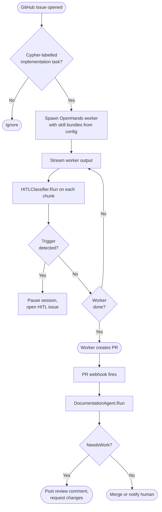

# Agent Design: Custom Agents vs Skill Bundle Workers

> This document defines the boundary between the two agent patterns in Project Cypher, specifies which agent personas use which pattern, and describes the Go interface a custom agent exposes to the orchestrator.

---

## The Core Distinction

Cypher has two fundamentally different types of agent execution:

| | Custom Agent | Skill Bundle Worker |
|---|---|---|
| **Purpose** | One narrow, well-defined task | Open-ended implementation goal |
| **Input** | Structured, predictable | GitHub Issue description |
| **Output** | Structured, typed | Pull Request |
| **LLM calls** | 1–3, deterministic prompt | Open-ended agentic loop |
| **Model tier** | Architect (Claude) | Primary Worker (Gemini / local LLM) |
| **Runtime** | Go function, no container | OpenHands session in Docker |
| **Tool set** | Hard-coded, minimal | Assembled from skill bundles |
| **Session state** | Stateless | Stateful (file edits, git history) |

**Custom agents are deterministic processors.** They take structured input, call Claude once or a small number of times with a precisely engineered prompt, and return a typed result the orchestrator acts on directly.

**Skill bundle workers are autonomous actors.** They receive a goal, have access to a broad tool set assembled from skill bundles, and operate in an open-ended loop until they produce a PR or hit a HITL trigger.

---

## Which Personas Go Where

### Custom Agents (narrow input → structured output)

These personas have well-defined inputs and expected output shapes. Non-determinism is the failure mode — the orchestrator needs a typed result it can act on, not a free-form LLM response.

| Persona | Input | Output | Why custom |
|---|---|---|---|
| **HITL Classifier** | Worker output text | `[]TriggerCategory` | Must reliably classify exactly the defined trigger categories. A false negative causes an unapproved architectural change to slip through. |
| **Documentation Agent** | PR diff + file contents | `ReviewResult{Status, Checks}` | Five binary checks, one structured comment. A skill bundle worker would write prose; the orchestrator needs a typed result to decide whether to block the PR. |
| **OSS Evaluator** | Package metadata + security signals | `EvalDecision{Adopt/Fork/Build, Rationale}` | The human approval flow (HITL) gates on this structured decision. Free-form text can't be reliably parsed by the orchestrator. |
| **PR Summarizer** | PR diff | `string` (markdown summary) | Single-shot summarisation — one LLM call, one string output. No tool use needed. |

### Skill Bundle Workers (open-ended goal → PR)

These tasks require genuine autonomy: the LLM must decide which files to read, what changes to make, how to structure commits, and how to respond to test failures. Constraining the tool set to a hard-coded list would underfit the task.

| Task type | Why skill bundle |
|---|---|
| **Issue implementation** | The tool set varies by project (Go testing, Python testing, different CI commands). Skill bundles let each project configure what the worker can do without code changes. |
| **Bug investigation** | Requires exploratory use of read/search/diff tools in an unpredictable order. The path through the code can't be pre-programmed. |
| **Refactoring tasks** | Needs broad file access and test-fix iteration. The failure modes are project-specific. |

---

## The Custom Agent Interface

Custom agents are Go types that implement a single interface. They are stateless — the orchestrator constructs one, calls `Run`, and discards it. All LLM calls go through the Architect client (#64).

```go
// Agent is the interface all custom agents implement.
// Implementations must be safe for concurrent use.
type Agent[Input, Output any] interface {
    Run(ctx context.Context, input Input) (Output, error)
}
```

Because input and output shapes differ significantly across agents, the interface is generic rather than using `any` internally. Each agent defines its own concrete types:

```go
// HITLClassifier detects escalation triggers in worker output.
type HITLClassifier struct{ llm ArchitectClient }

func (c *HITLClassifier) Run(ctx context.Context, input HITLInput) (HITLResult, error)

type HITLInput struct {
    WorkerOutput string
    TaskContext  string
}

type HITLResult struct {
    Triggers []TriggerCategory // e.g. NewDependency, ArchitecturalChange, SecurityImplication
    Rationale string
}

// DocumentationAgent reviews a PR for documentation completeness.
type DocumentationAgent struct{ llm ArchitectClient }

func (a *DocumentationAgent) Run(ctx context.Context, input DocReviewInput) (DocReviewResult, error)

type DocReviewInput struct {
    PRNumber     int
    ChangedFiles []string
    PRDescription string
    FileContents map[string]string // path → content for checked files
}

type DocReviewResult struct {
    Status  ReviewStatus // Pass or NeedsWork
    Checks  DocChecks
    Comment string // full markdown comment to post on the PR
}

// OSSEvaluator assesses a package for adoption.
type OSSEvaluator struct{ llm ArchitectClient }

func (e *OSSEvaluator) Run(ctx context.Context, input OSSEvalInput) (OSSEvalResult, error)

type OSSEvalInput struct {
    PackageName    string
    ImportPath     string
    Motivation     string // why we're considering this package
    Alternatives   []string
}

type OSSEvalResult struct {
    Decision  OSSDecision // Adopt, UseAsReference, BuildOwn
    Rationale string
    Concerns  []string
    HITLRequired bool // always true — OSS adoption always escalates to human
}
```

---

## Orchestrator Dispatch

The orchestrator dispatches to either path based on the trigger:



For HITL escalations involving an OSS package, the orchestrator calls `OSSEvaluator.Run()` before creating the HITL issue, so the issue contains a pre-populated evaluation for the human to review rather than an empty request.

---

## The documentation-agent Skill Bundle

The existing `skills/documentation-agent.yaml` should be **migrated to a custom agent** (`DocumentationAgent`) once the Architect client (#64) exists. The skill bundle currently describes what an OpenHands session should do, but the task is fundamentally a structured processor: five binary checks → one structured comment. Running it as an OpenHands session wastes a container startup, adds non-determinism, and gives the LLM unnecessary latitude to go off-task.

The skill bundle remains in `skills/` as the prompt source — the `context_pack` and check descriptions become the system prompt for `DocumentationAgent.Run()`. The tools in the bundle (read_file, list_changed_files, etc.) become direct GitHub API calls the Go code makes before passing context to the LLM.

Until #64 is implemented, the skill bundle stays as-is. **Do not remove it.**

---

## What Changes With This Design

1. **No new OpenHands session for reviewer personas.** Documentation review, OSS evaluation, and HITL classification are Go function calls that call Claude, not container spin-ups.

2. **Skill bundles remain for implementation workers.** The `git-operations`, `github-pr`, and `go-testing` bundles are unchanged. Any project-specific tool sets are still added as new bundles.

3. **New `internal/agents/` package** will house the custom agent types and the shared `ArchitectClient` interface. Each agent is a sub-package (`agents/docreview`, `agents/hitlclassify`, `agents/osseval`).

4. **The skill bundle format is unchanged.** Bundles that describe implementation worker capabilities keep their current YAML format. The distinction is purely in how the orchestrator invokes them.
