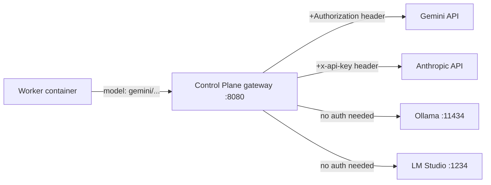

# LLM Backend Setup

Project Cypher routes all worker LLM calls through its Control Plane gateway. Workers never hold credentials — the gateway injects them server-side. This document explains how to configure each backend.

---

## How routing works

Every LLM request from a worker container carries a model string in the form `vendor/model-name` (e.g. `gemini/gemini-2.0-flash`). The gateway reads the prefix, resolves the target endpoint, injects credentials, and proxies the request. Workers only ever talk to `http://host.docker.internal:8080` (the gateway address).



---

## Tier strategy

| Tier | Vendor prefix | Backend | When to use |
|---|---|---|---|
| Primary Worker | `gemini/` | Gemini API (free-tier) | Default for all task work |
| Architect | `anthropic/` | Anthropic API | Guardrails only — not for task work |
| Overflow Worker | `ollama/` | Ollama (local) | When Gemini quota is exhausted |
| Overflow Worker | `lmstudio/` | LM Studio (local) | GPU-accelerated local inference |

Set `worker_model` in your project config to control which backend workers use:

```yaml
# configs/my-project.yaml
worker_model: gemini/gemini-2.0-flash   # primary
# worker_model: ollama/qwen2.5-coder    # overflow — swap in when Gemini quota hit
# worker_model: lmstudio/qwen2.5-coder  # overflow via LM Studio
```

---

## Quick setup

Run `just store-llm-keys` to configure everything interactively. It handles both cloud API keys (stored in 1Password) and local LLM endpoint URLs (written directly to `.env`):

```
$ just store-llm-keys

Cloud API keys (stored in 1Password — leave empty to skip):
  GEMINI_API_KEY: ••••••••••••••••••••
  ✓ stored → op://Private/cypher-gemini-key/credential
  ANTHROPIC_API_KEY: (empty)
  skipping ANTHROPIC_API_KEY
  OPENAI_API_KEY: (empty)
  skipping OPENAI_API_KEY

Local LLM endpoints (press Enter to accept default):
  Ollama URL [http://host.docker.internal:11434]: 
  ✓ CYPHER_OLLAMA_URL = http://host.docker.internal:11434
  LM Studio URL [http://host.docker.internal:1234]: 
  ✓ CYPHER_LMSTUDIO_URL = http://host.docker.internal:1234

  ✓ .env updated
```

Run `just doctor` after to verify the keys are accessible.

---

## Cloud APIs

### Gemini (primary worker)

1. Go to [Google AI Studio](https://aistudio.google.com/app/apikey) and create an API key.
2. Run `just store-llm-keys` and enter it at the `GEMINI_API_KEY` prompt.

The key is stored as `op://Private/cypher-gemini-key/credential` in 1Password and referenced in `.env`.

### Anthropic (architect tier only)

1. Go to [Anthropic Console](https://console.anthropic.com/) and create an API key.
2. Run `just store-llm-keys` and enter it at the `ANTHROPIC_API_KEY` prompt.

Anthropic is **only used for architect-tier guardrails** (OSS evaluation, doc reviews, security checks). It is never used for task implementation. If this key is absent, those guardrails are inactive but workers still run normally.

---

## Local LLMs (WSL2 + Windows host)

The default endpoint URLs in `just store-llm-keys` point to `host.docker.internal` — the DNS name that resolves to the Windows host from inside Docker containers and WSL2. This is correct for the standard Phase 1 setup where LM Studio or Ollama runs on the Windows host.

### LM Studio

LM Studio exposes an OpenAI-compatible API. To use it as an overflow worker:

1. Download and install [LM Studio](https://lmstudio.ai/) on Windows.
2. Load a model (e.g. `Qwen2.5-Coder-32B-Instruct`).
3. Start the local server in LM Studio (default port: **1234**). Under *Server Settings*, enable **"Accept connections from network"** so WSL2 can reach it.
4. Run `just store-llm-keys` and accept the default `http://host.docker.internal:1234` for the LM Studio URL, or enter a custom address.
5. In your project config, set `worker_model: lmstudio/<model-name>` where the model name matches what LM Studio is serving.

LM Studio does not require an API key by default. If you enable authentication in LM Studio's settings, store the key as `OPENAI_API_KEY` via `just store-llm-keys`.

### Ollama

1. Install [Ollama](https://ollama.com/) on the Windows host (or WSL2).
2. Pull the model you want: `ollama pull qwen2.5-coder:32b`
3. If running on Windows, Ollama listens on `0.0.0.0:11434` by default and is reachable from WSL2 via `host.docker.internal`.
4. Run `just store-llm-keys` and accept the default `http://host.docker.internal:11434`, or enter a custom address.
5. In your project config, set `worker_model: ollama/<model-name>`.

---

## Env vars reference

| Variable | What it does | Set via |
|---|---|---|
| `GEMINI_API_KEY` | Authenticates requests to the Gemini API | `just store-llm-keys` (1Password) |
| `ANTHROPIC_API_KEY` | Authenticates architect-tier guardrail calls | `just store-llm-keys` (1Password) |
| `OPENAI_API_KEY` | Authenticates OpenAI API calls (or LM Studio with auth) | `just store-llm-keys` (1Password) |
| `CYPHER_OLLAMA_URL` | Overrides default Ollama endpoint (`http://localhost:11434`) | `just store-llm-keys` (plain `.env`) |
| `CYPHER_LMSTUDIO_URL` | Overrides default LM Studio endpoint (`http://localhost:1234`) | `just store-llm-keys` (plain `.env`) |

Cloud API keys (`GEMINI_API_KEY`, etc.) are stored as `op://` vault references in `.env` — the orchestrator resolves them via 1Password at startup. Endpoint URLs are plain values written directly to `.env`.
