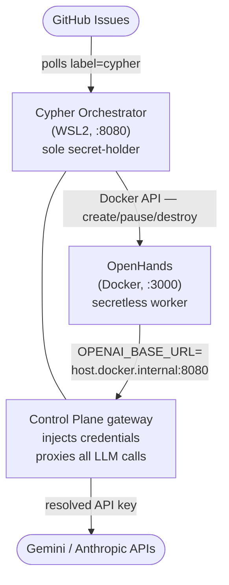

# Operator Runbook: First Dogfood Run

This document walks from a fresh checkout to a running orchestrator that
picks up a real issue, opens a branch, makes changes, and submits a PR —
using project-cypher to develop project-cypher.

---

## Architecture recap



The orchestrator is the **sole secret-holder**. Workers never see API keys.
Credentials live in 1Password; `.env` holds `op://` references, not secrets.

---

## Prerequisites

```bash
mise install        # installs Go 1.24.6 and just 1.51.0
just check          # confirm all tests are green before proceeding
```

Required CLI tools (install separately if missing):
- [Docker](https://docs.docker.com/engine/install/) — for the OpenHands worker container
- [1Password CLI (`op`)](https://developer.1password.com/docs/cli/get-started/) — for secret resolution at runtime
- `op signin` must succeed before running the orchestrator

---

## Step 1 — Create the GitHub App with `just setup`

`just setup` registers a GitHub App against the target repo, installs it, and
writes the App credentials to `.env`. It also handles 1Password storage for the
private key PEM. Run it once per repo you want Cypher to manage.

```bash
just setup-dry-run   # verify vault access without creating anything
just setup           # create the App, store PEM in 1Password, update .env
```

`just setup` writes these to `.env`:

```
CYPHER_GH_APP_ID=<app-id>
CYPHER_GH_APP_PRIVATE_KEY=op://Private/<item>/private key
CYPHER_GH_INSTALLATION_ID=<installation-id>
```

These three credentials are sufficient. The orchestrator uses them to generate
short-lived installation access tokens automatically — no separate PAT is needed.

## Step 2 — Store remaining secrets in 1Password

```bash
# Gemini API key — from Google AI Studio (free tier works)
op item create --category login --title "project-cypher-gemini" \
  --vault Private credential=<paste-key>

# Anthropic API key — for Architect-tier agents (OSS eval, doc review, security review)
op item create --category login --title "project-cypher-anthropic" \
  --vault Private credential=<paste-key>

# Webhook secret — only needed if exposing the gateway via a public URL (see Step 7)
op item create --category login --title "project-cypher-webhook-secret" \
  --vault Private credential=$(openssl rand -hex 32)
```

---

## Step 3 — Write `.env` with `op://` references

`.env` is gitignored and auto-loaded by `just`. It holds vault references, not
secrets. The `secrets.ResolveEnv` call in the orchestrator resolves them at
startup via the `op` CLI.

`just setup` has already written the App credentials. Add the remaining lines:

```bash
# .env  (just setup already wrote CYPHER_GH_APP_* lines above this)
GEMINI_API_KEY=op://Private/project-cypher-gemini/credential
ANTHROPIC_API_KEY=op://Private/project-cypher-anthropic/credential

# Optional — only set if wiring the PR webhook (see Step 7)
# CYPHER_GH_WEBHOOK_SECRET=op://Private/project-cypher-webhook-secret/credential
```

**Alternative: `op run` without a `.env` file.** If you prefer not to keep a
`.env` file on disk, prefix any `just` command with `op run --`:

```bash
op run -- just run-once
```

`op run` resolves `op://` references from the current environment before the
process starts. The two approaches are equivalent; `.env` is more convenient
for iterative local development.

---

## Step 4 — Pull the worker image

The orchestrator creates OpenHands containers on demand via the Docker API.
Pull the image once so the first task dispatch doesn't time out:

```bash
docker pull ghcr.io/all-hands-ai/openhands:main
```

Confirm Docker is reachable:

```bash
docker info >/dev/null && echo "Docker OK"
```

On WSL2, Docker Desktop must be running with the WSL2 integration enabled for
the `/var/run/docker.sock` socket to be available inside WSL2.

---

## Step 5 — Start OpenHands

OpenHands runs as a persistent service. The orchestrator calls its REST API
at `CYPHER_OPENHANDS_URL` (default `http://localhost:3000`) to start and
monitor conversations.

Workers are configured with `OPENAI_BASE_URL=http://host.docker.internal:8080`
so their LLM calls route through the Cypher gateway rather than hitting vendor
APIs directly. The gateway injects the real API key server-side.

```bash
docker run -d \
  --name cypher-openhands \
  --restart unless-stopped \
  -p 3000:3000 \
  -v /var/run/docker.sock:/var/run/docker.sock \
  -e OPENAI_BASE_URL=http://host.docker.internal:8080 \
  -e LLM_MODEL=gemini/gemini-2.0-flash \
  -e LLM_API_KEY=gateway-injected \
  ghcr.io/all-hands-ai/openhands:main
```

Notes:
- `LLM_API_KEY=gateway-injected` is a placeholder — the real key is injected
  by the gateway and never reaches the container directly.
- `-v /var/run/docker.sock:/var/run/docker.sock` lets OpenHands manage its own
  runtime sandboxes inside Docker.
- If you stop and remove this container, restart it before the next orchestrator run.

To check it is up:
```bash
curl -sf http://localhost:3000/api/options/models | head -c 100
```

---

## Step 6 — Verify the environment

```bash
just doctor
```

All checks must pass before proceeding. Expected output:

```
  ✓ CYPHER_GH_APP_ID set
  ✓ CYPHER_GH_INSTALLATION_ID set
  ✓ GitHub App credentials valid
  ✓ config file readable
  ✓ config file valid
  ✓ Docker socket reachable
  ✓ worker image available
  ✓ OpenHands endpoint responding
```

Common failures and fixes:

| Failure | Fix |
|---|---|
| `CYPHER_GH_APP_ID set` | Run `just setup`; confirm `.env` has the App ID line |
| `GitHub App credentials valid` | Run `op signin`; verify `CYPHER_GH_APP_PRIVATE_KEY` resolves correctly |
| `Docker socket reachable` | Start Docker Desktop; confirm WSL2 integration is enabled |
| `worker image available` | Run `docker pull ghcr.io/all-hands-ai/openhands:main` |
| `OpenHands endpoint responding` | Start the OpenHands container (Step 4) |

---

## Step 7 — Run once

With all checks passing, process the oldest `cypher`-labelled issue:

```bash
just run-once
```

The orchestrator will:
1. Fetch open issues labelled `cypher` from `armarquez/project-cypher`
2. Create a feature branch (`feat/issue-N-title`)
3. Start an OpenHands conversation with the assembled worker prompt
   (task description + skill context from `git-operations`, `github-pr`, `go-testing`)
4. Poll for HITL markers — pause and escalate to GitHub if triggered
5. Wait for the worker to finish and submit a PR

Watch logs to verify the gateway is receiving and proxying LLM calls.

To run continuously:

```bash
just run-loop     # polls every 30 seconds
```

---

## Step 8 — Webhook setup (optional, for PR review agents)

The Documentation Agent and Security Reviewer fire on `pull_request` webhook
events. GitHub must be able to reach `{host}:8080/webhook`. In Phase 1
(WSL2 laptop) there is no permanent public URL, so these agents are dormant
by default.

**Option A: Tailscale Funnel** (recommended — stable URL, no account required beyond free tier)

```bash
tailscale funnel 8080
```

This exposes `https://<machine>.ts.net/` → `localhost:8080`. Update the
GitHub App webhook URL to `https://<machine>.ts.net/webhook`.

**Option B: ngrok** (URL changes on restart unless you have a paid plan)

```bash
ngrok http 8080
```

Set `CYPHER_GH_WEBHOOK_SECRET` in `.env` (the `op://` reference from Step 2)
and configure the GitHub App or repo webhook to deliver to `https://<ngrok-url>/webhook`
with the same secret value.

Until a public URL is configured, the issue→PR flow works without webhooks —
PR review agents just don't fire automatically.

---

## Environment variable reference

| Variable | Required | Description |
|---|---|---|
| `CYPHER_GH_APP_ID` | Yes | GitHub App ID — written by `just setup` |
| `CYPHER_GH_APP_PRIVATE_KEY` | Yes | `op://` reference to App private key PEM — written by `just setup` |
| `CYPHER_GH_INSTALLATION_ID` | Yes | GitHub App installation ID — written by `just setup` |
| `GEMINI_API_KEY` | Yes | Worker LLM API key (proxied through gateway) |
| `ANTHROPIC_API_KEY` | No | Architect LLM key — OSS eval, doc review, security review inactive without it |
| `CYPHER_GH_WEBHOOK_SECRET` | No | HMAC secret for webhook delivery verification |
| `CYPHER_OPENHANDS_URL` | No | OpenHands API base URL (default: `http://localhost:3000`) |
| `CYPHER_WORKER_IMAGE` | No | OpenHands Docker image (default: `ghcr.io/all-hands-ai/openhands:main`) |
| `CYPHER_DOCKER_SOCKET` | No | Docker socket path (default: `/var/run/docker.sock`) |
| `CYPHER_CONFIG` | No | Config file path (default: `configs/project-cypher.yaml`) |
